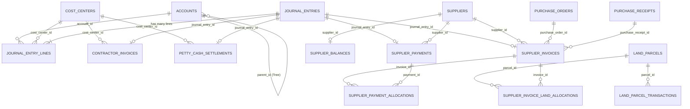

# الوضع الفعلي الحالي للمنظومة المالية والمحاسبية (CURRENT_ACCOUNTING_STATE)
**تاريخ الفحص الشامل (Deep Scan):** أكتوبر 2026  
**الصفة:** مهندس معماريات برمجيات (Senior Software Architect) وخبير أنظمة مالية وتخطيط موارد (ERP Specialist)  
**طبيعة الوثيقة:** وثيقة معمارية مرجعية توثق **الكود الفعلي المكتوب حالياً** في الواجهتين الخلفية (Laravel) والأمامية (React/TypeScript) دون أي افتراضات مسبقة.

---

## الفهرس العام
1. [الهيكل الفعلي لقاعدة البيانات المالية (Database Reality & Data Models)](#1-الهيكل-الفعلي-لقاعدة-البيانات-المالية-database-reality--data-models)
2. [مسارات ومتحكمات الإدارة المالية (API Routes, Controllers & Accounting Automation)](#2-مسارات-ومتحكمات-الإدارة-المالية-api-routes-controllers--accounting-automation)
3. [شاشات الواجهة الأمامية للشق المالي (Frontend Financial Screens & Navigation)](#3-شاشات-الواجهة-الأمامية-للشق-المالي-frontend-financial-screens--navigation)
4. [صلاحيات وأدوار المدير المالي ومحاسبي الأقسام (Roles, Permissions & Segregation of Duties)](#4-صلاحيات-وأدوار-المدير-المالي-ومحاسبي-الأقسام-roles-permissions--segregation-of-duties)
5. [خلاصة معمارية وتوصيات التطوير (Architectural Summary & Next Steps)](#5-خلاصة-معمارية-وتوصيات-التطوير-architectural-summary--next-steps)

---

## 1. الهيكل الفعلي لقاعدة البيانات المالية (Database Reality & Data Models)

تتألف المنظومة المالية في قاعدة البيانات الحالية من مجموعتين متكاملتين:
1. **نواة الأستاذ العام وشجرة الحسابات (General Ledger & Costing Core):** تم إنشاؤها عبر تهجيرات سبتمبر 2026 (`2026_09_19_*`).
2. **الذمم الدائنة للموردين وحسابات الأراضي (Supplier Payables & Land Parcels):** تم إنشاؤها عبر تهجيرات أغسطس 2026 (`2026_08_18_*` و `2026_08_21_*`) مع تعديلات ربط القيود التلقائية لاحقاً.

### 1.1 جدول شجرة الحسابات (`accounts`)
- **الملف المصدري:** `database/migrations/2026_09_19_160001_create_accounts_table.php`
- **النموذج (Model):** [Account.php](file:///e:/purchasing%20system/app/Models/Accounting/Account.php)
- **الحقول:**
  - `id` (BigIncrements)
  - `code` (string, Unique, Index): رمز الحساب المالي (مثل `1111`, `2111`, `511`, `512`).
  - `name` (string): اسم الحساب باللغة العربية.
  - `type` (enum): نوع الحساب من المعايير المحاسبية الدولية:
    - `asset` (أصول)
    - `liability` (خصوم / التزامات)
    - `equity` (حقوق ملكية)
    - `revenue` (إيرادات)
    - `expense` (مصروفات)
  - `parent_id` (foreignId, nullable, constrained to `accounts`, onDelete cascade): الحساب الأب لتوليد الهيكل الشجري الهرمي.
  - `timestamps`
- **العلاقات المبرمجة في النموذج:**
  - `parent()`: ينتمي إلى حساب أب (`belongsTo(Account::class, 'parent_id')`).
  - `children()`: يمتلك حسابات فرعية شجرية (`hasMany(Account::class, 'parent_id')`).
  - `journalEntryLines()`: يمتلك أسطر قيود يومية مسجلة عليه (`hasMany(JournalEntryLine::class)`).
  - Scope: `scopeRoots()` لجلب الحسابات الرئيسية من المستوى الأول (`parent_id IS NULL`).

---

### 1.2 جدول مراكز التكلفة (`cost_centers`)
- **الملف المصدري:** `database/migrations/2026_09_19_160002_create_cost_centers_table.php`
- **النموذج (Model):** [CostCenter.php](file:///e:/purchasing%20system/app/Models/Accounting/CostCenter.php)
- **الحقول:**
  - `id` (BigIncrements)
  - `code` (string, Unique, Index): رمز مركز التكلفة (مثل `CC-101`, `CC-PLOT-05`).
  - `name` (string): اسم مركز التكلفة / اسم المشروع أو قطعة الأرض.
  - `is_active` (boolean, default: true, Index): حالة تفعيل المركز.
  - `timestamps`
- **العلاقات المبرمجة في النموذج:**
  - `journalEntryLines()`: أسطر القيود المرتبطة بمركز التكلفة (`hasMany(JournalEntryLine::class)`).
  - `contractorInvoices()`: مستخلصات المقاولين المحملة على هذا المركز (`hasMany(ContractorInvoice::class)`).
  - `pettyCashSettlements()`: تسويات العهد النثرية المحملة على هذا المركز (`hasMany(PettyCashSettlement::class)`).

---

### 1.3 جدول القيود اليومية العامة (`journal_entries`)
- **الملف المصدري:** `database/migrations/2026_09_19_160003_create_journal_entries_table.php`
- **النموذج (Model):** [JournalEntry.php](file:///e:/purchasing%20system/app/Models/Accounting/JournalEntry.php)
- **الحقول:**
  - `id` (BigIncrements)
  - `entry_number` (string, Unique, nullable): رقم القيد المحاسبي المتسلسل.
  - `date` (date): تاريخ سريان القيد المحاسبي.
  - `description` (text, nullable): شرح / بيان القيد العام.
  - `reference_number` (string, nullable, Index): الرقم المرجعي الخارجي (رقم الفاتورة، السند، أو المستخلص).
  - `status` (enum: `DRAFT`, `POSTED`, default: `POSTED`, Index): حالة القيد (مسودة أو مرحل للأستاذ العام).
  - `created_by` (foreignId, nullable, constrained to `users`, nullOnDelete): المحاسب أو المستخدم المنشئ.
  - `timestamps`
- **العلاقات والميزات المبرمجة:**
  - `lines()`: أسطر القيد التفصيلية (`hasMany(JournalEntryLine::class)`).
  - `creator()`: مستخدم النظام منشئ القيد (`belongsTo(User::class, 'created_by')`).
  - `isBalanced()` (Method): دالة فحص توازن القيد رياضياً: $\sum(\text{Debit}) == \sum(\text{Credit})$.
  - `getTotalDebitAttribute()` و `getTotalCreditAttribute()`: حساب إجمالي الطرفين المدين والدائن.

---

### 1.4 جدول أسطر القيود اليومية (`journal_entry_lines`)
- **الملف المصدري:** `database/migrations/2026_09_19_160004_create_journal_entry_lines_table.php`
- **النموذج (Model):** [JournalEntryLine.php](file:///e:/purchasing%20system/app/Models/Accounting/JournalEntryLine.php)
- **الحقول:**
  - `id` (BigIncrements)
  - `journal_entry_id` (foreignId, constrained to `journal_entries`, cascadeOnDelete)
  - `account_id` (foreignId, constrained to `accounts`, cascadeOnDelete)
  - `cost_center_id` (foreignId, nullable, constrained to `cost_centers`, nullOnDelete): مركز التكلفة التحليلي المحمل عليه السطر.
  - `debit` (decimal 15,2, default: 0.00): المبلغ المدين (ج.م).
  - `credit` (decimal 15,2, default: 0.00): المبلغ الدائن (ج.م).
  - `description` (string, nullable): البيان المحاسبي التفصيلي للسطر.
  - `timestamps`
- **العلاقات المبرمجة:**
  - `journalEntry()`: ينتمي إلى القيد الأم (`belongsTo(JournalEntry::class)`).
  - `account()`: ينتمي إلى حساب مالي في الشجرة (`belongsTo(Account::class)`).
  - `costCenter()`: ينتمي إلى مركز تكلفة تحليلي اختياري (`belongsTo(CostCenter::class)`).

---

### 1.5 جدول مستخلصات المقاولين (`accounting_contractor_invoices`)
- **الملف المصدري:** `database/migrations/2026_09_19_170001_create_accounting_contractor_invoices_table.php`
- **النموذج (Model):** [ContractorInvoice.php](file:///e:/purchasing%20system/app/Models/Accounting/ContractorInvoice.php)
- **الحقول:**
  - `id` (BigIncrements)
  - `cost_center_id` (foreignId, constrained to `cost_centers`, restrictOnDelete)
  - `contractor_name` (string): اسم مقاول الباطن / المنفذ.
  - `invoice_number` (string): رقم المستخلص أو المطالبة المالية.
  - `date` (date): تاريخ المستخلص.
  - `amount` (decimal 15,2): القيمة الإجمالية للمستخلص.
  - `description` (text, nullable): بيان الأعمال المنفذة بالمستخلص.
  - `status` (enum: `DRAFT`, `PENDING_APPROVAL`, `APPROVED`, `PAID`, default: `DRAFT`).
  - `journal_entry_id` (foreignId, nullable, constrained to `journal_entries`, nullOnDelete): القيد اليومي المولد آلياً عند الاعتماد.
  - `timestamps`
- **العلاقات المبرمجة:**
  - `costCenter()`: يتبع مركز تكلفة المشروع (`belongsTo(CostCenter::class)`).
  - `journalEntry()`: القيد المحاسبي المقابل (`belongsTo(JournalEntry::class)`).

---

### 1.6 جدول تسويات العهد والمصروفات النثرية (`accounting_petty_cash_settlements`)
- **الملف المصدري:** `database/migrations/2026_09_19_180001_create_accounting_petty_cash_settlements_table.php`
- **النموذج (Model):** [PettyCashSettlement.php](file:///e:/purchasing%20system/app/Models/Accounting/PettyCashSettlement.php)
- **الحقول:**
  - `id` (BigIncrements)
  - `cost_center_id` (foreignId, constrained to `cost_centers`, restrictOnDelete)
  - `employee_name` (string): اسم الموظف صاحب العهدة أو مسوي المنصرفات.
  - `settlement_number` (string): رقم إذن التسوية النثرية.
  - `date` (date): تاريخ تسوية العهدة.
  - `amount` (decimal 15,2): إجمالي قيمة المنصرفات المسواة.
  - `description` (text, nullable): تفاصيل وبيان الفواتير النثرية المرفقة بالعهدة.
  - `status` (enum: `DRAFT`, `PENDING_APPROVAL`, `APPROVED`, default: `DRAFT`).
  - `journal_entry_id` (foreignId, nullable, constrained to `journal_entries`, nullOnDelete): القيد اليومي المولد آلياً عند الاعتماد.
  - `timestamps`
- **العلاقات المبرمجة:**
  - `costCenter()`: يتبع مركز تكلفة المشروع (`belongsTo(CostCenter::class)`).
  - `journalEntry()`: القيد المحاسبي المقابل (`belongsTo(JournalEntry::class)`).

---

### 1.7 جداول فواتير الموردين، السدادات، والأرصدة (`supplier_*`)
- **الملفات المصدرية:**
  - `database/migrations/2026_08_18_000004_create_supplier_financial_accounts.php`
  - `database/migrations/2026_09_19_193000_add_journal_entry_id_to_supplier_financial_tables.php`
- **النماذج (Models):**
  - [SupplierInvoice.php](file:///e:/purchasing%20system/app/Models/SupplierInvoice.php)
  - [SupplierPayment.php](file:///e:/purchasing%20system/app/Models/SupplierPayment.php)
  - [SupplierPaymentAllocation.php](file:///e:/purchasing%20system/app/Models/SupplierPaymentAllocation.php)
  - [SupplierBalance.php](file:///e:/purchasing%20system/app/Models/SupplierBalance.php)
- **الجداول والعلاقات:**
  1. `supplier_invoices`:
     - الحقول: `id`, `supplier_id`, `purchase_order_id`, `purchase_receipt_id`, `created_by`, `invoice_number`, `invoice_date`, `due_date`, `amount`, `paid_amount`, `outstanding_amount`, `status` (`DRAFT`, `OPEN`, `PARTIALLY_PAID`, `PAID`, `CANCELLED`), `matching_status` (`MATCHED`, `PENDING`, `DISCREPANCY`), `journal_entry_id` (FK إلى `journal_entries`).
     - العلاقات: يتبع `Supplier`, `PurchaseOrder`, `PurchaseReceipt`, `JournalEntry`، وله `paymentAllocations`, `landAllocations`.
  2. `supplier_payments`:
     - الحقول: `id`, `supplier_id`, `accountant_user_id`, `payment_number`, `amount`, `payment_date`, `payment_method` (`BANK_TRANSFER`, `CASH`, `CHEQUE`), `reference_number`, `allocated_amount`, `overpayment_amount`, `notes`, `journal_entry_id` (FK إلى `journal_entries`).
     - العلاقات: يتبع `Supplier`, `User` (المحاسب الصارف), `JournalEntry`، وله `allocations` (تخصيصات سداد الفواتير).
  3. `supplier_payment_allocations`:
     - جدول وسيط لتخصيص سداد دفعة على فاتورة معينة بنظام FIFO: `supplier_payment_id`, `supplier_invoice_id`, `amount`.
  4. `supplier_balances`:
     - الحقول: `id`, `supplier_id`, `opening_balance`, `total_invoiced`, `total_paid`, `current_balance`, `last_invoice_at`, `last_payment_at`.

---

### 1.8 جداول قطع الأراضي وتوزيع التكاليف (`land_parcels_*`)
- **الملفات المصدرية:** `database/migrations/2026_08_21_000001_*` إلى `2026_08_22_000001_*`
- **النماذج (Models):**
  - [LandParcel.php](file:///e:/purchasing%20system/app/Models/LandParcel.php)
  - [LandParcelTransaction.php](file:///e:/purchasing%20system/app/Models/LandParcelTransaction.php)
  - [SupplierInvoiceLandAllocation.php](file:///e:/purchasing%20system/app/Models/SupplierInvoiceLandAllocation.php)
- **الجداول والعلاقات:**
  1. `land_parcels`:
     - الحقول: `id`, `parcel_reference` (رقم قطعة الأرض), `region` (المنطقة), `opening_balance`, `current_balance`, `notes`.
  2. `land_parcel_transactions`:
     - حركات الخزينة والتمويل المالي للقطعة: `land_parcel_id`, `created_by`, `transaction_type` (`OPENING_BALANCE`, `CUSTOMER_FUNDING`, `INVOICE_EXPENSE`), `amount`, `balance_after`, `transaction_date`, `reference_number`, `notes`.
  3. `supplier_invoice_land_allocations`:
     - توزيع وتحميل قيمة فاتورة مورد مشتريات على قطعة أرض محددة لضبط تكلفة المشروع الفعلي.

---

### 1.9 مخطط الكيانات والعلاقات الفعلية (ER Diagram - Mermaid)



---

## 2. مسارات ومتحكمات الإدارة المالية (API Routes, Controllers & Accounting Automation)

جميع المسارات المالية مسجلة في ملف [routes/api.php](file:///e:/purchasing%20system/routes/api.php) وتخضع لمصادقة `auth:sanctum` وصلاحيات Spatie المحددة.

### 2.1 وحدة الحسابات العامة ومراكز التكلفة (General Accounting Module)
- **البادئة:** `/api/accounting`
- **الحماية:** `middleware(['auth:sanctum', 'permission:accounting.invoice.view|purchase_order.view_accounting|system.users.manage'])`

| المسار (Endpoint) | الطريقة (Method) | المتحكم والوظيفة | الوصف والعملية المحاسبية المنجزة |
| :--- | :---: | :--- | :--- |
| `/accounting/accounts` | `GET` | `AccountController@index` | استعراض شجرة الحسابات (شجري كامل `tree=1` أو مصفوفة مسطحة `flat`). |
| `/accounting/accounts/{id}` | `GET` | `AccountController@show` | استعراض تفاصيل حساب مالي معين وحركاته. |
| `/accounting/cost-centers` | `GET` | `CostCenterController@index` | جلب قائمة مراكز التكلفة (مع فلترة النشطة فقط أو الكل `all=true`). |
| `/accounting/cost-centers/{id}` | `GET` | `CostCenterController@show` | استعراض تفاصيل مركز تكلفة محدد. |
| `/accounting/contractor-invoices` | `GET` | `ContractorInvoiceController@index` | استعراض مستخلصات مقاولي الباطن مع فلاتر الحالة ومركز التكلفة. |
| `/accounting/contractor-invoices` | `POST` | `ContractorInvoiceController@store` | إنشاء مسودة مستخلص مقاول باطن جديد لمشروع محدد. |
| `/accounting/contractor-invoices/{id}` | `GET` | `ContractorInvoiceController@show` | استعراض بيانات مستخلص والقيد المحاسبي المولد له إن وجد. |
| `/accounting/contractor-invoices/{id}` | `PUT` | `ContractorInvoiceController@update` | تعديل مستخلص (متاح فقط طالما لم يتم اعتماده `DRAFT`). |
| `/accounting/contractor-invoices/{id}` | `DELETE` | `ContractorInvoiceController@destroy` | حذف مستخلص مسودة. |
| `/accounting/contractor-invoices/{id}/approve` | `POST` | `ContractorInvoiceController@approve` | **اعتماد المستخلص وتوليد قيد يومية آلي مرحل (POSTED)**. |
| `/accounting/petty-cash-settlements` | `GET` | `PettyCashSettlementController@index` | استعراض تسويات العهد النثرية ومصروفات الموظفين. |
| `/accounting/petty-cash-settlements` | `POST` | `PettyCashSettlementController@store` | تسجيل تسوية عهدة نثرية جديدة. |
| `/accounting/petty-cash-settlements/{id}` | `GET` | `PettyCashSettlementController@show` | استعراض بيانات تسوية العهدة والقيد المحاسبي التابع لها. |
| `/accounting/petty-cash-settlements/{id}` | `PUT` | `PettyCashSettlementController@update` | تعديل تسوية العهدة قبل الاعتماد. |
| `/accounting/petty-cash-settlements/{id}` | `DELETE` | `PettyCashSettlementController@destroy` | حذف تسوية عهدة مسودة. |
| `/accounting/petty-cash-settlements/{id}/approve` | `POST` | `PettyCashSettlementController@approve` | **اعتماد تسوية العهدة وتوليد قيد يومية آلي مرحل (POSTED)**. |
| `/accounting/reports/cost-centers` | `GET` | `CostCenterReportController@summary` | استخراج تقرير تكاليف المشاريع ومراكز التكلفة الإجمالي ونسب التحميل. |
| `/accounting/reports/cost-centers/{id}/statement` | `GET` | `CostCenterReportController@statement` | استخراج كشف حساب تحليلي تفصيلي لحركات وقيود المشروع بفترة زمنية. |

---

### 2.2 وحدة فواتير الموردين والمدفوعات والمطابقة (Supplier Payables & Accounts)
- **البادئة:** `/api/accounting`
- **المتحكم:** [SupplierInvoiceController.php](file:///e:/purchasing%20system/app/Http/Controllers/Api/V1/SupplierInvoiceController.php)
- **الخدمة:** [SupplierInvoiceService.php](file:///e:/purchasing%20system/app/Services/SupplierInvoiceService.php)

| المسار (Endpoint) | الطريقة (Method) | الصلاحية المشروطة | الوصف والعملية المحاسبية المنجزة |
| :--- | :---: | :--- | :--- |
| `/accounting/receipts/approved` | `GET` | `accounting.invoice.view` | جلب أذونات الاستلام المفحوصة والمطابقة من المخزن ومهندس الموقع الجاهزة للفوترة (مفلترة بحسب أقسام المحاسب). |
| `/accounting/invoices` | `GET` | `accounting.invoice.view` | استعراض فواتير الموردين المسجلة وحالات مطابقتها وسدادها. |
| `/accounting/invoices` | `POST` | `accounting.invoice.create` | **تسجيل فاتورة مورد ومطابقتها وتوزيعها على قطع الأراضي وتوليد القيد الآلي**. *(محظور تماماً على المدير المالي 403، مسند لمحاسبي الأقسام)*. |
| `/accounting/invoices/{id}/match` | `POST` | `accounting.invoice.match` | تنفيذ المطابقة الثلاثية الحسابية وتغيير حالة الفاتورة. |
| `/accounting/invoices/{id}/payments` | `POST` | `accounting.payment.create` | تسجيل سداد دفعة نقدية أو بنكية لفاتورة مورد محددة وتوليد القيد. |
| `/accounting/suppliers/{id}/payments` | `POST` | `accounting.payment.create` | **تسجيل صرف دفعة على الحساب العام للمورد** وتوزيعها بنظام FIFO وتوليد القيد. |
| `/accounting/suppliers/accounts` | `GET` | `supplier.account.view` | كشف أرصدة جميع الموردين وإجمالي المسحوبات والمسدد والمتبقي. |
| `/accounting/suppliers/{id}/account` | `GET` | `supplier.account.view` | كشف حساب تفصيلي للمورد (دفتر الأستاذ المالي، الفواتير، الدفعات، عروض الأسعار). |
| `/accounting/suppliers/{id}/opening-balance` | `POST` | `accounting.invoice.create` | تعيين أو تعديل الرصيد الافتتاحي السابق للمورد. |

---

### 2.3 وحدة دفتر قطع الأراضي والتمويل (Land Parcels Ledger)
- **المتحكم:** [LandParcelController.php](file:///e:/purchasing%20system/app/Http/Controllers/Api/V1/LandParcelController.php)

| المسار (Endpoint) | الطريقة (Method) | الصلاحية المشروطة | الوصف والعملية المحاسبية |
| :--- | :---: | :--- | :--- |
| `/accounting/land-parcels` | `GET` | متعدد الأدوار المالية والإدارية | استعراض سجل قطع الأراضي وأرصدتها الحالية. |
| `/accounting/land-parcels` | `POST` | `accounting.invoice.create` | فتح سجل قطعة أرض جديدة وتحديد الرصيد الافتتاحي. |
| `/accounting/land-parcels/{id}` | `GET` | `accounting.invoice.view` | جلب كشف حساب القطعة والمنصرفات والتحصيلات. |
| `/accounting/land-parcels/{id}/fund` | `POST` | `accounting.invoice.create` | تسجيل دفعة تحصيل تمويل عميل على القطعة. |
| `/accounting/land-parcels/{id}` | `DELETE` | `accounting.invoice.create` | حذف سجل قطعة أرض. |

---

### 2.4 الرقابة المالية على أوامر وطلبات الشراء وعروض الأسعار
1. **أوامر الشراء للحسابات (`/api/accounting/purchase-orders`):**
   - المتحكم: [AccountingPurchaseOrderController.php](file:///e:/purchasing%20system/app/Http/Controllers/Api/V1/AccountingPurchaseOrderController.php)
   - العمليات: `index` و `show` للقراءة والمراجعة المالية فقط.
   - **قاعدة معماريات هامة:** الدوال `approve` و `returnToProcurement` في هذا المتحكم ترجع خطأ قطعي `403 Forbidden` برسالة: `"Prohibited action: Accountant has read-only access. Approval is not allowed."`، حيث إن اعتماد أمر الشراء حصري للمدير العام بعد اكتمال الدورة.
2. **اعتمادات الشراء المباشر الفوري (`/api/accounting/purchase-requests`):**
   - المتحكم: [AccountingPurchaseRequestController.php](file:///e:/purchasing%20system/app/Http/Controllers/Api/V1/AccountingPurchaseRequestController.php)
   - العمليات:
     - `GET /purchase-requests/direct-approval`: جلب طلبات الشراء ذات المسار المباشر (مثل المكتبيات أو المواد العاجلة).
     - `POST /purchase-requests/{id}/direct-approve`: اعتماد الطلب مالياً مع تحديد المورد والأسعار التقديرية.
     - `POST /purchase-requests/{id}/direct-reject`: رفض الطلب المباشر مع تدوين السبب.
3. **التقييم والترشيح المالي لعروض الأسعار (`/api/purchase-quotes`):**
   - دالة `recommend`: يمتلك المدير المالي صلاحية رفع التوصية المالية على عروض الأسعار المسجلة (`roleType = ACCOUNTING`).

---

### 2.5 آليات توليد القيود المحاسبية التلقائية (Double-Entry Bookkeeping Engine)

النظام مبرمج آلياً على تكوين قيود يومية متوازنة في جدول `journal_entries` و `journal_entry_lines` بحالة `POSTED` فور اكتمال الإجراءات التالية (معتمدة على ملف التكوين [config/accounting.php](file:///e:/purchasing%20system/config/accounting.php)):

#### أ. قيد مستخلص مقاول باطن (Contractor Invoice Approval):
عند تنفيذ `approve()` في `ContractorInvoiceController`:
- **مدين (Dr):** حساب تكلفة تشغيل مشروعات / مقاولي باطن (رمز `512` - `Contractor Expense`) محمل على `cost_center_id`.
- **دائن (Cr):** حساب مستحقات مقاولي باطن (رمز `2113` - `Contractor Payable`).

#### ب. قيد تسوية عهدة نثرية (Petty Cash Settlement Approval):
عند تنفيذ `approve()` في `PettyCashSettlementController`:
- **مدين (Dr):** حساب مصروفات تشغيلية / عمومية نثرية (رمز `513` - `Petty Cash Expense`) محمل على `cost_center_id`.
- **دائن (Cr):** حساب عهدة الموظفين النقدية (رمز `112` - `Petty Cash Custody`).

#### ج. قيد فوترة مشتريات مورد (Supplier Invoice Creation / Match):
عند تسجيل الفاتورة في `SupplierInvoiceService::generateSupplierInvoiceJournalEntry`:
- **مدين (Dr):** حساب تكلفة مواد وخامات مشتراة (رمز `511` - `Material Expense`) محمل على مركز تكلفة المشروع المستفيد.
- **دائن (Cr):** حساب ذمم دائنة - موردين (رمز `2111` - `Supplier Payable`).

#### د. قيد سداد دفعة لمورد (Supplier Payment Recorded):
عند تسجيل سداد دفعة في `SupplierInvoiceService::generateSupplierPaymentJournalEntry`:
- **مدين (Dr):** حساب ذمم دائنة - موردين (رمز `2111` - `Supplier Payable`) لتخفيض المديونية.
- **دائن (Cr):**
  - حساب الخزينة النقدية (رمز `1111` - `Treasury Cash`) في حالة الدفع نقداً `CASH`.
  - حساب البنك (رمز `1112` - `Bank Account`) في حالة التحويل البنكي `BANK_TRANSFER` أو الشيك `CHEQUE`.

---

## 3. شاشات الواجهة الأمامية للشق المالي (Frontend Financial Screens & Navigation)

تتمركز شاشات الشق المالي في المجلد [src/pages/accounting/](file:///e:/purchasing%20system/src/pages/accounting/) ومربوطة في نظام التوجيه [src/routes/AppRoutes.tsx](file:///e:/purchasing%20system/src/routes/AppRoutes.tsx).

### 3.1 فهرس الشاشات المالية المبرمجة فعلياً
1. **[AccountingDashboardPage.tsx](file:///e:/purchasing%20system/src/pages/accounting/AccountingDashboardPage.tsx) - لوحة تحكم المدير المالي:**
   - المسار: `/accounting`
   - المكونات:
     - `QuickLauncherBar`: شريط الإجراءات والوصول السريع.
     - `ActionRequiredInbox`: صندوق الإجراءات والمهام العاجلة (أوامر شراء معلقة، طلبات شراء مباشرة، عروض أسعار تحتاج ترشيحاً مالياً).
     - `KpiPillsBar`: مؤشرات الأداء الحية لقيم الشراء والتوريدات ومستحقات الموردين.
     - `DashboardBars`: رسوم بيانية لحجم الإنفاق التراكمي حسب القسم والموردين.
     - جدول أحدث أوامر الشراء المصدرة مع نافذة الطباعة والمراجعة.
2. **[SiteAccountantDashboardPage.tsx](file:///e:/purchasing%20system/src/pages/accounting/SiteAccountantDashboardPage.tsx) - لوحة محاسبي الأقسام التشغيلية:**
   - المسار: `/site-accountant`
   - المكونات: تبويبات متابعة أذونات الاستلام الجاهزة للتسجيل، فواتير الموردين، أوامر الشراء، وطلبات الشراء الخاصة بالمحاسب مع صندوق المهام المطلوب تنفيذها فورياً.
3. **[SupplierFinanceWorkspacePage.tsx](file:///e:/purchasing%20system/src/pages/accounting/SupplierFinanceWorkspacePage.tsx) - مساحة العمل المالية الموحدة للموردين:**
   - المسارات: `/accounting/supplier-finance`, `/accounting/supplier-payments`, `/accounting/supplier-accounts`
   - تدمج شاشتين بتنسيق Tabbed View:
     - **تبويب كشوف الحسابات:** [SupplierAccountsPage.tsx](file:///e:/purchasing%20system/src/pages/accounting/SupplierAccountsPage.tsx):
       - جدول أرصدة الموردين مع الفلترة الذكية والبحث.
       - بطاقة كشف حساب المورد التفصيلي (Dedicated Statement View): دفتر الأستاذ العام (Ledger)، سجل الفواتير، وسجل السدادات، وأرشيف عروض الأسعار المرفوعة من المورد.
       - نافذة صرف دفعة وتسجيل إيصال سداد نقدي أو بنكي.
     - **تبويب فواتير الموردين والمطابقة:** [SupplierPaymentsPage.tsx](file:///e:/purchasing%20system/src/pages/accounting/SupplierPaymentsPage.tsx):
       - جدول أذونات الاستلام المعتمدة المعلقة في انتظار الفوترة.
       - **معاينة صور الفحص المخزني وبون الميزان (Weighbridge Scale Photo Modal)** مع التكبير المباشر لتدقيق الأوزان والأختام.
       - شاشة المطابقة الثلاثية للمستندات (أمر الشراء + إذن الاستلام + الفاتورة).
       - محرر توزيع الفاتورة على قطع الأراضي (`LandAllocationEditor`).
4. **[ChartOfAccountsPage.tsx](file:///e:/purchasing%20system/src/pages/accounting/ChartOfAccountsPage.tsx) - دليل وشجرة الحسابات:**
   - المسار: `/accounting/chart-of-accounts`
   - المكونات: عرض شجري تفاعلي كامل، فلاتر حسب نوع الحساب (الأصول 1، الخصوم 2، الملكية 3، الإيرادات 4، المصروفات 5)، أدوات الطي والتوسيع، مؤشر توازن، والبحث بالاسم أو الكود.
5. **[CostCentersPage.tsx](file:///e:/purchasing%20system/src/pages/accounting/CostCentersPage.tsx) - مراكز التكلفة وقطع الأراضي:**
   - المسار: `/accounting/cost-centers`
   - المكونات: بطاقات إحصائية للمراكز النشطة والإجمالية، جدول استعراض الأكواد والأسماء، والبحث والفلترة.
6. **[ContractorInvoicesPage.tsx](file:///e:/purchasing%20system/src/pages/accounting/ContractorInvoicesPage.tsx) - مستخلصات المقاولين:**
   - المسار: `/accounting/contractor-invoices`
   - المكونات:
     - نافذة تسجيل مستخلص مقاول باطن جديد وربطه بمركز التكلفة ومبلغ الأعمال.
     - زر الاعتماد المحاسبي (`اعتماد المستخلص`) الذي يولد القيد المزدوج فوراً.
     - نافذة استعراض القيد المحاسبي المولد ومطالعة الطرفين المدين والدائن.
7. **[PettyCashPage.tsx](file:///e:/purchasing%20system/src/pages/accounting/PettyCashPage.tsx) - تسويات العهد والمصروفات النثرية:**
   - المسار: `/accounting/petty-cash`
   - المكونات:
     - نافذة تسجيل إذن تسوية عهدة موظف بمصروفات ومرفقات وبيان تفصيلي.
     - زر الاعتماد المحاسبي وتوليد القيد المزدوج التلقائي.
     - نافذة استعراض القيد المحاسبي لسطور العهدة المسواة.
8. **[ProjectCostsReportPage.tsx](file:///e:/purchasing%20system/src/pages/accounting/ProjectCostsReportPage.tsx) - تقرير تكاليف المشاريع ومراكز التكلفة:**
   - المسار: `/accounting/reports/project-costs`
   - المكونات:
     - ملخص تكاليف المشاريع مع الرسوم البيانية ونسب الإنفاق لكل مشروع.
     - كشف حساب تحليلي تفصيلي للمشروع (Project Statement Modal) يعرض حركات القيود اليومية مع فلترة المدى الزمني وطباعة كشف الحساب.
9. **[LandParcelsPage.tsx](file:///e:/purchasing%20system/src/pages/accounting/LandParcelsPage.tsx) - دفتر مشاريع وقطع الأراضي:**
   - المسارات: `/accounting/land-parcels`, `/general-manager/land-parcels`
   - المكونات: إدارة وتتبع القطع، تسجيل تحصيلات تمويل العملاء، وكشف حساب تفصيلي يوزع منصرفات المواد ومطالبات الفواتير المخصصة لكل قطعة.
10. **[AccountingPurchaseOrdersPage.tsx](file:///e:/purchasing%20system/src/pages/accounting/AccountingPurchaseOrdersPage.tsx) و [AccountingPurchaseOrderDetailsPage.tsx](file:///e:/purchasing%20system/src/pages/accounting/AccountingPurchaseOrderDetailsPage.tsx):**
    - المسار: `/accounting/purchase-orders`
    - استعراض ومراجعة أوامر الشراء المعتمدة تجارياً، فحص بنودها وأسعارها وملاحظاتها المالية وشروط دفعها.
11. **[AccountingPurchaseRequestsPage.tsx](file:///e:/purchasing%20system/src/pages/accounting/AccountingPurchaseRequestsPage.tsx):**
    - المسار: `/accounting/purchase-requests`
    - شاشة التدقيق المالي لطلبات الشراء المباشرة والاعتماد المالي السريع.

---

### 3.2 واقع الربط في الواجهة (Navigation Reality Check)
- **شاشات مربوطة بالقائمة الجانبية الحالية ([AuthenticatedLayout.tsx](file:///e:/purchasing%20system/src/layouts/AuthenticatedLayout.tsx)):**
  - لوحة المحاسبة (`/accounting`)
  - موافقات الطلبات المالية (`/accounting/purchase-requests`)
  - أوامر الشراء للحسابات (`/accounting/purchase-orders`)
  - ترشيح عروض الأسعار (`/accounting/purchase-quotes`)
  - فواتير الموردين والمطابقة (`/accounting/supplier-payments`)
  - حسابات وصرف الموردين (`/accounting/supplier-accounts`)
  - دفتر قطع الأراضي (`/accounting/land-parcels`)
  - التقارير والتحليلات (`/accounting/reports`)
- **شاشات مبرمجة ومسجلة في الـ Routes ولكن غير مدرجة في القائمة الجانبية حتى الآن:**
  - دليل الحسابات (`/accounting/chart-of-accounts`)
  - مراكز التكلفة (`/accounting/cost-centers`)
  - مستخلصات المقاولين (`/accounting/contractor-invoices`)
  - تسويات العهد النثرية (`/accounting/petty-cash`)
  - تقارير تكاليف المشاريع (`/accounting/reports/project-costs`)
  *(ملاحظة معمارية: هذه الشاشات الخمسة تم بناؤها واختبارها بالكامل كوحدة MVP معزولة، ومساراتها مفعلة برمجياً لمن يملك صلاحيات المحاسبة، ولكن لم يتم إضافة روابطها النصية في الـ Sidebar الخاص بالقالب العام).*

---

## 4. صلاحيات وأدوار المدير المالي ومحاسبي الأقسام (Roles, Permissions & Segregation of Duties)

### 4.1 التوصيف الفعلي لدور `accountant`
بناءً على [RolePermissionSeeder.php](file:///e:/purchasing%20system/database/seeders/RolePermissionSeeder.php) و [roleRouting.ts](file:///e:/purchasing%20system/src/routes/roleRouting.ts):
- اسم الدور في النظام: **المدير المالي (Financial Director)**.
- الوصف المعتمد: *"المدير المالي - مسؤول الرقابة المالية الشاملة والاعتمادات والتقارير"*.
- مسار الصفحة الرئيسية للمدير المالي: `/accounting`.

---

### 4.2 قاعدة فصل المهام المحاسبية الصارمة (Strict Segregation of Duties)
أثبت الفحص الشمولي للكود وجود فصل معماري دقيق ومقصود بين مهام **محاسبي الأقسام التشغيلية** و **المدير المالي**:

```
[محاسب القسم المختص]                                    [المدير المالي]
(Site / Licenses / Buffet Accountant)                    (Financial Director)
               │                                                  │
               ▼                                                  ▼
1. مراجعة أذونات استلام المخزن                             1. الرقابة والتدقيق الشامل
2. تدقيق بون الميزان وصور الفحص                           2. حظر تسجيل الفواتير (منع تضارب المصالح)
3. تسجيل فواتير الموردين (حصرياً)                         3. تسجيل وصرف الدفعات وسندات الصرف (حصرياً)
4. توزيع الفاتورة على قطع الأراضي                         4. تسوية واعتماد عهد الموظفين
5. حظر تسجيل سندات الصرف والدفعات                          5. اعتماد مستخلصات المقاولين
                                                          6. الرقابة على دفتر تمويل قطع الأراضي
                                                          7. التقييم والترشيح المالي لعروض الأسعار
```

#### 1. حظر المدير المالي من تسجيل الفواتير:
في ملف [SupplierInvoiceController.php](file:///e:/purchasing%20system/app/Http/Controllers/Api/V1/SupplierInvoiceController.php) السطر 55:
```php
if ($user->hasRole('accountant') && ! $user->hasRole('admin')) {
    return response()->json([
        'message' => 'غير مصرح للمدير المالي بتسجيل الفواتير؛ تسجيل الفواتير مسند لمحاسب القسم التابع له أمر الشراء فقط.',
    ], 403);
}
```
وفي الواجهة الأمامية [SupplierPaymentsPage.tsx](file:///e:/purchasing%20system/src/pages/accounting/SupplierPaymentsPage.tsx) السطر 614:
يختفي زر `تسجيل فاتورة المورد` عند دخول المدير المالي ويظهر بدلاً منه وسم تنبيهي:
`"مسند لمحاسب القسم المختص للتسجيل"`.

#### 2. اختصاص تسجيل الفواتير لمحاسبي الأقسام بحسب الاختصاص الجغرافي والإداري:
تم تقسيم صلاحية تسجيل الفواتير ومطابقة الأذونات حسب مصفوفة الأقسام في `SupplierInvoiceService.php`:
- `site_accountant` (محاسب الموقع): مختص بأقسام التنفيذ والتشطيبات والمباني (`EXECUTION`, `FINISHING`, `BUILDINGS`).
- `licenses_accountant` (محاسب التراخيص): مختص بقسم التراخيص (`LICENSES`).
- `buffet_accountant` (محاسب البوفيه والمكتبيات): مختص بقسم المكتبيات والبوفيه (`BUFFET`).

#### 3. اختصاص صرف الدفعات وتسجيل السدادات للمدير المالي:
- صلاحية `accounting.payment.create` ممنوحة لـ `accountant` (المدير المالي) و `admin` فقط.
- محاسبو الأقسام التشغيلية (`site_accountant`, `licenses_accountant`, `buffet_accountant`) **لا يملكون هذه الصلاحية**، وبالتالي لا يمكنهم صرف أموال أو إصدار سندات دفع للموردين؛ دورهم ينتهي عند إثبات استحقاق الفاتورة وتوزيعها.

---

### 4.3 مصفوفة الصلاحيات المقارنة في الكود الفعلي

| الصلاحية في الكود (Permission Slug) | المدير المالي (`accountant`) | محاسب الموقع (`site_accountant`) | محاسب التراخيص (`licenses_accountant`) | محاسب البوفيه (`buffet_accountant`) | المدير العام (`general_manager`) |
| :--- | :---: | :---: | :---: | :---: | :---: |
| `purchase_order.view_accounting` | ✅ | ✅ | ✅ | ✅ | ❌ (`view_gm`) |
| `accounting.invoice.view` | ✅ (شامل) | ✅ (أقسامه فقط) | ✅ (أقسامه فقط) | ✅ (أقسامه فقط) | ❌ |
| `accounting.invoice.create` | ⚠️ (مقيد برمجياً 403) | ✅ (أقسامه) | ✅ (أقسامه) | ✅ (أقسامه) | ❌ |
| `accounting.invoice.match` | ✅ | ✅ | ✅ | ✅ | ❌ |
| `accounting.payment.create` | ✅ (صرف الدفعات) | ❌ | ❌ | ❌ | ❌ |
| `supplier.account.view` | ✅ (جميع الموردين) | ✅ (موردي أقسامه) | ✅ (موردي أقسامه) | ✅ (موردي أقسامه) | ❌ |
| `purchase_request.accounting_view` | ✅ | ❌ | ❌ | ❌ | ❌ |
| `purchase_request.accounting_approve` | ✅ | ❌ | ❌ | ❌ | ❌ |
| `purchase_request.accounting_reject` | ✅ | ❌ | ❌ | ❌ | ❌ |
| `purchase_quote.recommend` | ✅ (ترشيح مالي) | ❌ | ❌ | ❌ | ❌ (صلاحية `decide`) |

---

## 5. خلاصة معمارية وتوصيات التطوير (Architectural Summary & Next Steps)

1. **الواقع المعماري المحاسبي الحالي:**
   - النظام يتضمن **نواة ERP مالية حقيقية** مبنية على القيد المزدوج (Double-Entry)، شجرة حسابات قياسية (1 أصول، 2 خصوم، 3 ملكية، 4 إيرادات، 5 مصروفات)، ومراكز تكلفة تحليلية.
   - عمليات الفوترة والسداد ومستخلصات المقاولين وتسويات العهد تولد قيوداً يومية آلية مرحلة ومربوطة بمراكز التكلفة وقطع الأراضي.
2. **فصل السلطات والرقابة المالية:**
   - مطبق بدقة استثنائية: المدير المالي يراقب، يعتمد المستخلصات، يسوي العهد، ويصرف الدفعات، ولا يقوم بتسجيل فواتير المشتريات بنفسه.
3. **توصيات وإجراءات مستقبلية موصى بها:**
   - **توسيع القائمة الجانبية للمدير المالي:** إضافة قسم فرعي أو روابط مباشرة في [AuthenticatedLayout.tsx](file:///e:/purchasing%20system/src/layouts/AuthenticatedLayout.tsx) لشاشات الحسابات العامة المعزولة: (دليل الحسابات، مراكز التكلفة، مستخلصات المقاولين، تسويات العهد، تقرير تكاليف المشاريع) لمنح المدير المالي وصولاً سلساً لها دون الحاجة لإدخال الرابط يدوياً.
   - **التقارير الختامية:** إمكانية إضافة ميزان المراجعة (Trial Balance) وقائمة الدخل (Income Statement) مستقبلاً للاستفادة الكاملة من أسطر القيود اليومية المتراكمة.
