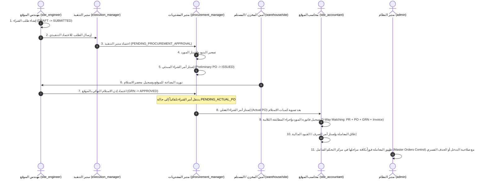

# مصفوفة الصلاحيات والأدوار (Role-Based Access Control - RBAC Matrix)
**نظام المشتريات والعهدة — شركة اشبيلية للتطوير العقاري والمقاولات**

تم إعداد هذا التوثيق المعماري بناءً على الفحص الشامل لكود الـ Backend (ملفات `RolePermissionSeeder.php`, `Controllers`, `Services`, `Policies`, `Middleware`) وكود الـ Frontend (`AuthenticatedLayout.tsx`, `AppRoutes.tsx`, `RoleRoute.tsx`, مكونات الواجهة والأزرار).

---

## 1. جدول مصفوفة الصلاحيات للأدوار المستهدفة (The Core Roles Matrix)

| الوظيفة / الدور | المعرف البرمجي (`slug`) | الصلاحيات الأساسية في الـ Backend | الصلاحيات والمسارات المتاحة في الـ Frontend | حدود وعزل البيانات (Scoping & Boundaries) |
| :--- | :--- | :--- | :--- | :--- |
| **مهندس الموقع** | `site_engineer` | • `purchase_request.create`<br>• `purchase_request.view_own`<br>• `purchase_request.edit_own`<br>• `purchase_request.submit`<br>• `purchase_receipt.view_assigned`<br>• `purchase_receipt.inspect`<br>• `purchase_receipt.approve`<br>• `site.inventory.view`<br>• `notification.view` | • `/requests` (طلبات الشراء الخاصة)<br>• `/requests/create` (إنشاء طلب)<br>• `/requests/supplements` (طلبات كمالة)<br>• `/requests/favorites` (المفضلة)<br>• `/site-engineer` (فحص واستلام البضاعة بالموقع) | • لا يرى إلا طلبات الشراء التي أنشأها بنفسه.<br>• لا تظهر له في قائمة الاستلام إلا أذونات الاستلام (`PurchaseReceipt`) الموجهة له بالاسم (`site_engineer_user_id`). |
| **مدير التنفيذ** | `execution_manager` | • `purchase_request.view_dept`<br>• `purchase_request.approve`<br>• `purchase_request.reject`<br>• `purchase_request.edit_during_review`<br>• `purchase_order.view`<br>• `purchase_receipt.view_assigned`<br>• `reports.purchases.view` | • `/general-manager/requests` (اعتماد طلبات الشراء المعلقة)<br>• `/general-manager/purchase-orders` (استعراض أوامر الشراء)<br>• `/site-engineer` (فحص أذونات الاستلام الخاصة بمشاريعه)<br>• `/reports/purchases` (تقارير المشتريات) | • يقتصر قراره واعتماده التنفيذي على طلبات الشراء الصادرة من المهندسين التابعين له إدارياً (`requester.manager_id = execution_manager.id`).<br>• لا يملك صلاحية تسعير أو إصدار أمر شراء أو فواتير. |
| **مدير المشتريات** | `procurement_manager` | • `purchase_request.view_all`<br>• `purchase_request.procurement_approve`<br>• `purchase_quote.create`<br>• `purchase_quote.manage`<br>• `purchase_order.create`<br>• `purchase_order.edit`<br>• `purchase_order.submit`<br>• `purchase_order.finalize_actual`<br>• `supplier.manage`<br>• `item.manage` | • `/procurement/requests` (الطلبات الواردة للتسعير)<br>• `/procurement/purchase-orders` (أوامر الشراء)<br>• `/procurement/purchase-orders/pending-actual` (إصدار PO الفعلي بعد الاستلام)<br>• `/procurement/suppliers` (الموردين)<br>• `/reports/purchases` (التقارير) | • يرى جميع طلبات الشراء المعتمدة تنفيذياً.<br>• **فصل مهام صارم (SOD):** ممنوع منعاً باتاً من تسجيل الفواتير (`403 Forbidden`). |
| **محاسب الموقع** | `site_accountant` | • `purchase_order.view`<br>• `purchase_receipt.view_assigned`<br>• `accounting.receipt.view`<br>• `accounting.invoice.create`<br>• `accounting.invoice.view`<br>• `accounting.invoice.match`<br>• `accounting.payment.create`<br>• `reports.purchases.view` | • `/site-accountant/dashboard` (لوحة تحكم الموقع)<br>• `/accounting/receipts` (أذونات الاستلام المعتمدة)<br>• `/accounting/supplier-finance` (فواتير ومطابقات الموردين)<br>• `/accounting/supplier-accounts` (كشوف الحسابات)<br>• `/accounting/supplier-payments` (مدفوعات وسندات الصرف) | • يقتصر نطاق عمله وفواتيره على إدارات الموقع الإنشائي فقط (`EXECUTION`, `FINISHING`, `BUILDINGS`).<br>• غير مصرح له بتسجيل فواتير لأقسام أخرى مثل التراخيص أو البوفيه. |
| **المدير العام** | `general_manager` | • `purchase_request.view_all`<br>• `purchase_request.executive_approve`<br>• `purchase_order.view_all`<br>• `purchase_quote.decision`<br>• `accounting.general_view`<br>• `reports.purchases.view`<br>• `audit_logs.view` | • `/general-manager/requests` (اعتماد طلبات الشراء العامة)<br>• `/general-manager/purchase-orders` (متابعة أوامر الشراء)<br>• `/reports/purchases` (التقارير التحليلية الشاملة) | • يعتمد الطلبات التي لا تتبع لمدير التنفيذ أو الطلبات السيادية والمباشرة.<br>• ممنوع من تسجيل الفواتير أو إنشاء PO مباشرة كإجراء وقائي لفصل المهام. |
| **مدير النظام** | `admin` | • جميع الصلاحيات (`*` All Permissions Bypass)<br>• `admin.orders.master_control`<br>• `admin.orders.force_edit`<br>• `admin.orders.force_delete`<br>• إدارة المستخدمين والأدوار والتهيئة | • `/admin/orders-master` (مركز التحكم الشامل بالطلبات)<br>• `/admin` (لوحة الإدارة الرئيسية)<br>• `/admin/users`, `/admin/roles`<br>• `/admin/departments`, `/admin/categories`, `/admin/items`, `/admin/suppliers`<br>• `/admin/audit-logs` | • صلاحية تجاوز كاملة (Bypass).<br>• يملك حق التدخل والتعديل القسري (Force Edit) والحذف النهائي الشامل (Cascade Force Delete) لأي معاملة. |

---

## 2. الدورة المستندية الكاملة (Procurement Life-Cycle Workflow)



---

## 3. نتائج تدقيق الأمان واكتشاف الثغرات (Security & RBAC Audit Findings)

أثناء الفحص المعماري الدقيق لملفات الـ Backend والـ Frontend، تم رصد النقاط التالية:

### الثغرة الأولى: التحقق الصارم من هوية مهندس الموقع دون استثناء الأدمن في خدمة أذونات الاستلام
* **المكان:** `app/Services/PurchaseReceiptService.php` في الدالتين `approveBySiteEngineer` و `updateBySiteEngineer`.
* **المشكلة:** الكود يتحقق من:
  ```php
  if ($receipt->site_engineer_user_id !== $siteEngineer->id) {
      throw new \RuntimeException('هذا الإذن غير مخصص لمهندس الموقع الحالي.');
  }
  ```
  هذا التحقق لا يستثني دور مدير النظام (`admin`)، مما يمنع مدير النظام من استخدام صلاحية التجاوز الممنوحة له لإجراء تعديل أو اعتماد إداري طارئ على أذونات الاستلام العالقة.
* **الحل والتصحيح المقترح:**
  تعديل الشرط ليصبح:
  ```php
  if (!$siteEngineer->hasRole('admin') && (int) $receipt->site_engineer_user_id !== (int) $siteEngineer->id)
  ```

### الثغرة الثانية: ظهور الزر العائم لإنشاء طلب شراء (`+`) لأدوار غير مخولة
* **المكان:** `src/layouts/AuthenticatedLayout.tsx` (سطر 596-611).
* **المشكلة:** يظهر الزر العائم الدائم (`+ طلب شراء جديد`) لجميع المستخدمين طالما أن الدور ليس `admin` (`primaryRoleSlug !== 'admin'`). وبالتالي، يظهر الزر لمحاسب الموقع، وأمين المخزن، حتى وإن لم يكونوا مخولين بإنشاء طلبات شراء أو كانت أدوارهم مخصصة فقط للمراجعة المالية والمخزنية.
* **الحل والتصحيح المقترح:**
  ربط ظهور الزر بصلاحية إنشاء الطلبات `hasPermission('purchase_request.create')` بدلاً من مجرد استبعاد الأدمن.

### الملاحظة الثالثة: تعيين المدير المباشر (`manager_id`) لطلبات مدير التنفيذ
* **المكان:** `app/Services/GeneralManagerPurchaseRequestService.php`.
* **التفاصيل:** لكي تظهر طلبات الشراء لمدير التنفيذ (`execution_manager`) للاعتماد، يجب أن يكون صاحب الطلب (`requester`) مرتبطاً بـ `manager_id` يشير إلى حساب مدير التنفيذ، وإلا فسيتم توجيه الطلب تلقائياً إلى صندوق المدير العام (`general_manager`). هذا التصميم ممتاز لعزل المشروعات ولكن يتطلب التأكد من ربط مهندسي المواقع بمدير التنفيذ في قاعدة البيانات.

### متانة فصل المهام (Strict SOD Enforcement) - نقطة قوة مؤكدة
* يمنع نظام الـ Backend كلاً من مدير المشتريات (`procurement_manager`)، والمدير العام (`general_manager`)، ومدير التنفيذ (`execution_manager`) من تسجيل الفواتير قطيعاً عبر رد حاسم بـ `403 Forbidden` في `SupplierInvoiceController.php`.
* كما يمنع المدير المالي العام (`accountant`) من تسجيل فواتير الإدارات التنفيذية والموقع بنفسه، ويلزمه بأن تتم عبر محاسب الموقع المختص (`site_accountant`).
