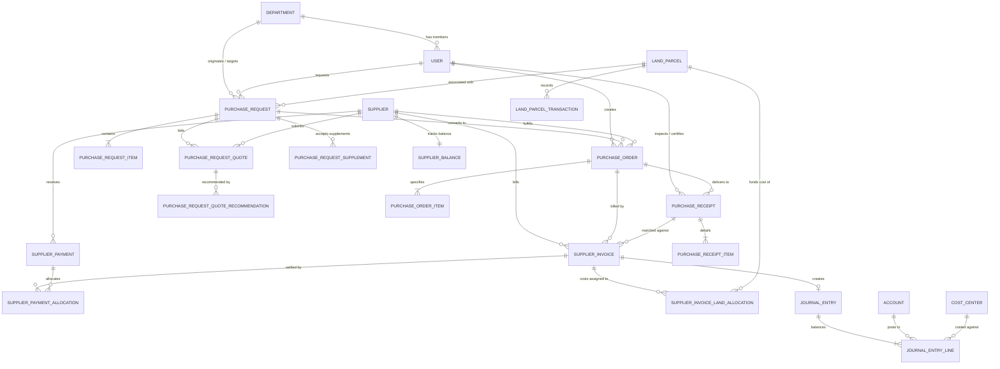
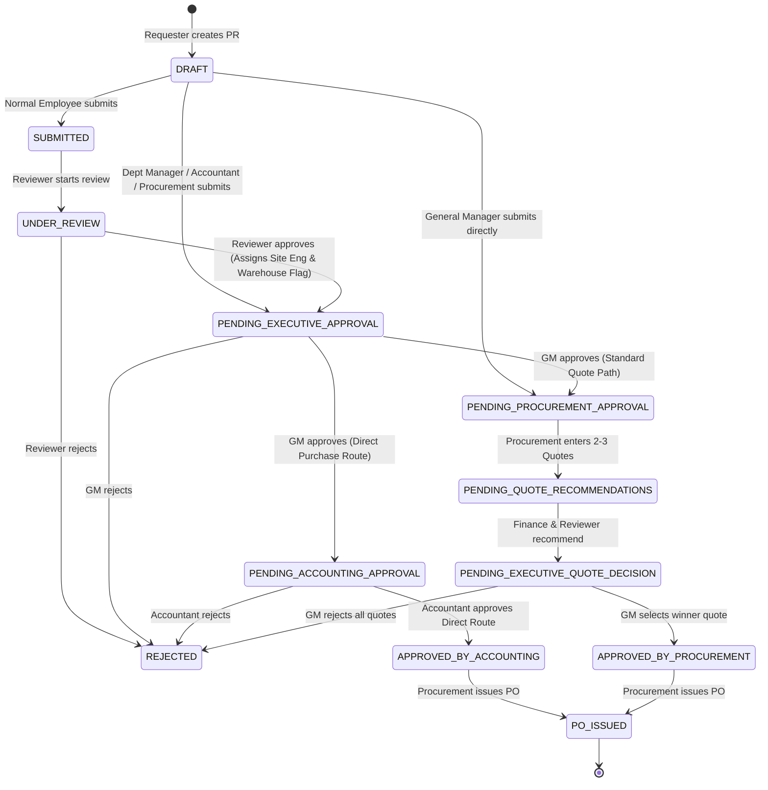
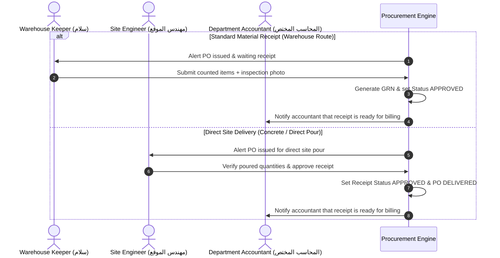

# SYSTEM_MEMORY.md — Central Architecture & System Reference
**Al-Ashbiliya Procurement & Financial Management System (منظومة إدارة المشتريات والمالية - شركة الأشبيليا)**

---

## 1. System Overview

### 1.1 Project Purpose & Domain
The **Al-Ashbiliya Procurement Management System** is an enterprise-grade procurement, material tracking, and financial control platform specifically engineered for **Al-Ashbiliya for Real Estate Development & Contracting** (شركة الأشبيليا للتطوير العقاري والمقاولات).

The system digitizes, governs, and automates the complete operational procurement pipeline—from project-site requisition through multi-level departmental and executive reviews, competitive quote bidding, purchase order dispatch, warehouse/site goods receipts, land-parcel cost allocation, and three-way invoice matching with double-entry accounting records.

### 1.2 Core Business Modules
1. **Purchase Requisitions (PR - طلبات الشراء):**
   - Supports two requisition classes: **PROJECT** (construction sites, concrete, rebar, finishing) and **OFFICE_SUPPLIES** (administrative, buffet, office equipment).
   - Mandatory financial traceability fields: Every construction line item requires a Land Parcel Reference (`item_reference` / `parcel_reference`) and a Geographic Zone (`region`).
   - Dynamic routing based on requester authority (Employee → Reviewer → GM → Procurement; Executive direct route; Department manager bypass).
   - Supplementary Requisitions (**طلبات كمالة**): Allows attaching additional line items to issued orders before full material receipt.

2. **Supplier Quotes & Recommendation Engine (عروض الأسعار والترشيحات):**
   - Competitive bidding mechanism requiring 2 to 3 supplier quotes for procurement requests.
   - Multi-tier recommendation pipeline: Financial Director (Hasan) submits an accounting recommendation first, followed by the Department Manager (Reviewer), culminating in a final quote decision by the General Manager.

3. **Purchase Orders (PO - أوامر الشراء):**
   - Automated conversion of approved PRs or selected quotes into legally binding purchase orders (`PO-YYYY-XXXXX`).
   - Multi-supplier support per PO item when items are split between specialized vendors.
   - Dual delivery paths: Standard Warehouse Receipt vs. Direct Site Delivery (e.g. ready-mix concrete poured directly on-site).

4. **Goods Receipts / GRN (استلام الخامات والمهمات):**
   - **Warehouse Flow:** Warehouse keeper counts and inspects incoming deliveries, attaches physical inspection photos, and issues Goods Receipt Notes (`GRN-YYYYMMDDHis-PO_ID`).
   - **Direct Site Flow:** Site engineers certify direct pours/deliveries on-site (with unit conversions such as bars to metric tons).
   - **Office Flow:** Requester confirms receipt of office/buffet supplies directly without warehouse bottleneck.

5. **Supplier Financial Accounts & Invoicing (فواتير وحسابات الموردين):**
   - 3-Way Matching: Cross-checks PO commercial lines, GRN received quantities, and Supplier Invoices within a 0.01 EGP tolerance.
   - Land Parcel Allocations: Splits invoice costs across project land parcels (`land_parcels`) to calculate exact land development costs.
   - Supplier ledger management: FIFO debt settlement, multi-invoice payment allocations, opening balances, and real-time debt tracking.

6. **General Accounting MVP (المحاسبة العامة ومراكز التكلفة):**
   - Isolated chart of accounts (`accounts`), cost centers (`cost_centers`), and automated double-entry journal entries (`journal_entries`, `journal_entry_lines`).
   - Contractor progress claims / Invoices (مستخلصات المقاولين).
   - Petty cash custody and settlements (تسويات العهد والمصروفات النثرية).

7. **System Governance, Audit & Monitoring (الحوكمة والرقابة):**
   - Field-level immutable audit logging (`audit_logs`) and system-wide business event timeline (`system_events`).
   - Multi-channel notification engine: Database in-app notifications, Server-Sent Events (SSE) streaming, and Firebase Cloud Messaging (FCM) Web Push.

---

## 2. Technology Stack

### 2.1 Backend Architecture
| Layer | Technology | Details |
| :--- | :--- | :--- |
| **Language & Runtime** | PHP 8.2+ | Platform lock: `8.2.33` (configured in `composer.json` for host parity) |
| **Framework** | Laravel 12.0 | High-performance, service-layer architecture |
| **Authentication** | Laravel Sanctum 4.3 | Stateful SPA bearer token authentication |
| **Spreadsheet Engine** | PhpSpreadsheet 5.9 | High-volume financial report exports to Excel |
| **File Storage** | AWS S3 / Cloudflare R2 | `league/flysystem-aws-s3-v3` v3.0 for quote documents & receipt photos |
| **Error Monitoring** | Sentry Laravel 4.3 | Real-time crash reporting and exception tracing |
| **Database Engines** | MySQL 8.0 / SQLite | Production runs MySQL; SQLite is used for offline testing/backups |
| **Background Queues** | Database Queue Driver | Asynchronous notification broadcasting and FCM push delivery |

### 2.2 Frontend Architecture
| Layer | Technology | Details |
| :--- | :--- | :--- |
| **Core Framework** | React 18.3.1 | Single-Page Application (SPA) with React Hooks & Context |
| **Build Tooling** | Vite 6.0.11 | High-speed ESM bundler with TypeScript integration |
| **Language** | TypeScript 5.6.3 | Strict typing across domain models, API contracts, and components |
| **Routing** | React Router DOM 7.18.2 | Declarative nested routing, role-based guards, lazy page loading |
| **Styling & Design System** | TailwindCSS 3.4.13 | Custom luxury theme (`charcoal`, `gold`, `copper`), RTL layout |
| **HTTP Client** | Axios 1.7.9 | Request interceptor (Sanctum auth), response interceptor (error handling, Arabic normalization) |
| **Push Notifications** | Firebase JS SDK 12.18.0 | Web Push notifications via Firebase Cloud Messaging (FCM) |
| **Testing** | Vitest 4.1.11 & Playwright 1.62.1 | Unit, integration, and End-to-End browser test automation |

---

## 3. Database Schema & Entity Relationships

### 3.1 Model Catalog
The backend contains **35 Eloquent Models** organized across core operational domains:

#### Organization & Identity
- `User`: Employees, managers, engineers, accountants, administrators.
- `Role`: Security roles (`admin`, `general_manager`, `accountant`, `site_accountant`, `licenses_accountant`, `buffet_accountant`, `procurement_manager`, `reviewer`, `warehouse_keeper`, `site_engineer`, `employee`).
- `Permission`: Fine-grained privileges (`purchase_request.create`, `purchase_order.view_accounting`, etc.).
- `Department`: Operational departments (`EXECUTION`, `BUILDINGS`, `FINISHING`, `LICENSES`, `BUFFET`). Holds `manager_user_id` and `site_engineer_user_id`.
- `UserDeviceToken`: Stores FCM device push tokens for Web Push.

#### Requisitions & Bidding
- `PurchaseRequest`: Requisition headers, tracking numbers (`PR-YYYY-XXXXX`), status, priorities, parcel references, reviewer/engineer assignments.
- `PurchaseRequestItem`: Requisition line items with quantities, units of measure, parcel references, and auto-catalog linkage.
- `PurchaseRequestQuote`: Supplier price quotations attached to PRs.
- `PurchaseRequestQuoteRecommendation`: Sequential recommendations by Accounting and Department Managers.
- `PurchaseRequestSupplement`: Supplementary requisition batches ("طلبات كمالة") attached to active PRs.

#### Orders & Receipts
- `PurchaseOrder`: Purchase order headers (`PO-YYYY-XXXXX`), supplier link, terms, delivery status, financial notes.
- `PurchaseOrderItem`: Commercial line items (quantities, agreed unit prices, line totals, per-item supplier overrides).
- `PurchaseReceipt`: Goods Receipt Notes (`GRN-...`), inspection photo path, warehouse keeper and site engineer sign-offs.
- `PurchaseReceiptItem`: Receipt line items tracking ordered vs. received quantities with unit conversion notes.

#### Financial Accounts & Suppliers
- `Supplier`: Vendor profiles, contact details, payment terms, opening balances.
- `SupplierBalance`: Aggregate financial snapshot per vendor (total invoices, total payments, net balance).
- `SupplierInvoice`: Invoices generated from approved receipts; tracks 3-way matching and debt status (`OPEN`, `PARTIALLY_PAID`, `PAID`).
- `SupplierPayment`: Vendor payments (`PAY-...`), payment methods, unallocated overpayment tracking.
- `SupplierPaymentAllocation`: Maps payments to open invoices using FIFO debt retirement.
- `SupplierInvoiceLandAllocation`: Allocates supplier invoice amounts to specific land parcel accounts.
- `LandParcel`: Real estate land plots (`parcel_reference`, `region`, funding total, expense total, balance).
- `LandParcelTransaction`: Audit trail of financial debits and credits on land parcels.

#### General Accounting MVP
- `Accounting\Account`: Chart of accounts with hierarchical parent-child relationships and types (`asset`, `liability`, `equity`, `revenue`, `expense`).
- `Accounting\CostCenter`: Cost center codes and tracking.
- `Accounting\JournalEntry`: Balanced double-entry financial journal headers.
- `Accounting\JournalEntryLine`: Debit and credit entries referencing accounts and cost centers.
- `Accounting\ContractorInvoice`: Contractor progress claims (مستخلصات مقاولين).
- `Accounting\PettyCashSettlement`: Petty cash disbursements and settlements (تسويات عهد ونثريات).

#### Governance & Auditing
- `ApprovalHistory`: Polymorphic log (`target_type`, `target_id`) tracking every workflow transition, actor, and comment.
- `AuditLog`: Low-level record of attribute mutations (`old_value`, `new_value`, field names).
- `SystemEvent`: High-level business timeline events displayed on entity detail screens.
- `Notification`: In-app notification records with document reference keys and read statuses.
- `Attachment`: Polymorphic file attachments (`attachable_type`, `attachable_id`).

---

### 3.2 Entity Relationship Diagram (ERD)



---

## 4. Core Procurement Workflows & Business Logic

### 4.1 Purchase Requisition (PR) Lifecycle



#### Detailed Workflow Rules:
1. **Creation & Validation:**
   - Any authenticated user can create a draft PR.
   - For `PROJECT` requests, `parcel_reference` (Land parcel ID or code) and `region` (Location zone) are strictly required. Missing values throw a `422 Unprocessable Entity` validation exception.
   - For `OFFICE_SUPPLIES`, `parcel_reference` defaults to `'مقر الشركة'` and `region` defaults to `'إداري / المقر الرئيسي'`.
   - New line items without an existing `item_id` automatically query catalog items by name or generate a new active catalog `Item` with an auto-generated SKU (`SKU-XXXXXX`).

2. **Submission & Intelligent Routing:**
   - **Executive Requester (General Manager):** The request bypasses both the departmental reviewer and executive approval gates, transitioning straight to `PENDING_PROCUREMENT_APPROVAL`. The site engineer must be specified upon submission.
   - **Management Requesters (Procurement Manager, Accountant, or Department Reviewer for own department):** Bypasses the Reviewer and transitions directly to `PENDING_EXECUTIVE_APPROVAL`.
   - **Standard Employee:** Transitions to `SUBMITTED`, notifying the designated department manager/reviewer.

3. **Departmental Review (`UNDER_REVIEW`):**
   - The Reviewer can edit quantities, modify line items, add or delete items, and update needed dates. Every change generates an explicit `AuditLog` entry.
   - Approving the PR requires specifying the **Site Engineer** (`site_engineer_user_id`) and configuring the **Warehouse Receipt Flag** (`requires_warehouse_receipt`).
   - Approval transitions the request to `PENDING_EXECUTIVE_APPROVAL`.

4. **Executive Decision (General Manager):**
   - The General Manager can approve, reject, or edit header and item details.
   - If the request route is `DIRECT`, approval routes it to `PENDING_ACCOUNTING_APPROVAL`.
   - If the request route is standard, approval routes it to `PENDING_PROCUREMENT_APPROVAL`.

5. **Competitive Quote Cycle (عروض الأسعار):**
   - The Procurement Manager enters 2 or 3 competing supplier quotes (`PurchaseRequestQuote`), including total price, unit price, notes, and PDF quotation documents.
   - **Sequential Recommendations:**
     1. **Financial Recommendation:** The Financial Director (`accountant`) submits a recommendation (`RECOMMEND` or `REJECT`) on the quotes first.
     2. **Departmental Recommendation:** Once the financial recommendation is recorded, the Department Reviewer receives a notification to submit their technical recommendation.
   - Once all required recommendations are recorded, the PR status moves to `PENDING_EXECUTIVE_QUOTE_DECISION`.
   - The General Manager selects the winning quote (`SELECTED`), setting the PR to `APPROVED_BY_PROCUREMENT`, which marks it ready for PO generation.

6. **Supplementary Requisitions (طلبات كمالة):**
   - Allows site engineers or department managers to order additional quantities or missing materials on an already approved PR (`canAcceptSupplement`).
   - Condition: Can only be created if the existing order has not yet been fully received on-site (no approved `PurchaseReceipt`).
   - Supplements retain the original PR number under batch increments (`batch_number: 1, 2...`) and can be seamlessly merged into the active PO.

---

### 4.2 Purchase Order (PO) Issuance & Fulfillment

1. **PO Creation:**
   - Created by the Procurement Manager from PRs in `APPROVED_BY_PROCUREMENT` or `APPROVED_BY_ACCOUNTING` state.
   - Sequence generation: `PO-YYYY-XXXXX`.
   - Inherits commercial pricing strictly from the selected supplier quote or accounting-approved direct cost.
   - Grand total formula: $\text{grand\_total} = \sum (\text{quantity} \times \text{unit\_price})$.

2. **PO Submission & Status Transitions:**
   - Procurement finalizes terms and submits the PO (`status: ISSUED`).
   - Statuses: `PO_DRAFT` $\rightarrow$ `ISSUED` $\rightarrow$ `DELIVERED`.
   - Automatic dispatch:
     - If `requiresWarehouseReceipt()` is true: Order enters the **Warehouse Receipt Queue**, alerting the warehouse keeper.
     - If `requiresWarehouseReceipt()` is false (direct site delivery): Automatically instantiates a site receipt queue item assigned directly to the site engineer.
     - If `isOfficeRequest()` is true: Generates an office receipt pending requester confirmation.

---

### 4.3 Goods Receipts (GRN) & Delivery Verification



- **Unit of Measure (UOM) Safety Conversion:** When steel rebar is requested in number of bars (`BAR`) by the site but purchased in metric tons (`TON`), the receipt engine calculates the weight ratio:
  $$\text{Ratio} = \frac{\text{PO Quantity (TON)}}{\text{PR Quantity (BAR)}}$$
  If the engineer logs the quantity in bars, the system auto-converts it to tons and appends an audit note: `[المستلم بالموقع: 40 BAR]`.

---

### 4.4 Financial Matching & Supplier Ledger

1. **Three-Way Matching (المطابقة الثلاثية):**
   - The responsible accountant creates a `SupplierInvoice` referencing the `PurchaseOrder` and the approved `PurchaseReceipt`.
   - The engine validates:
     $$\left| \text{Invoice Amount} - \sum (\text{Received Quantity} \times \text{PO Unit Price}) \right| \le 0.01\text{ EGP}$$
   - When matched, matching status becomes `MATCHED` and an automated double-entry journal entry is posted:
     - **Debit:** Material Expenses / Land Parcel Inventory Account.
     - **Credit:** Accounts Payable (Supplier Account).

2. **Land Parcel Cost Allocation:**
   - The invoice amount is allocated to specific land parcels (`SupplierInvoiceLandAllocation`), deducting from the parcel budget and incrementing `expense_total` on `land_parcels`.

3. **Supplier Payments & FIFO Settlement:**
   - Accountants issue payments (`SupplierPayment`) against a vendor.
   - The engine applies payment amounts to outstanding open invoices using **FIFO (First-In, First-Out)** order of invoice dates.
   - Recalculates `paid_amount`, `outstanding_amount`, and closes fully paid invoices (`PAID`).

---

## 5. Frontend Architecture

### 5.1 Routing & Role-Based Access Control (RBAC)

The application enforces strict client-side role guards via `<RoleRoute allowedRoles={[...]} />` and `<ProtectedRoute />`.

```
/
├── /login                                   (Public authentication screen)
├── /requests                                (Shared Requisition List - all roles)
├── /requests/create                         (Shared Requisition Form - all roles)
├── /requests/:id                            (Requisition Detail & Timeline)
├── /requests/:id/edit                       (Editable while in DRAFT/UNDER_REVIEW)
├── /requests/supplements                    (Supplementary items workspace)
│
├── /employee                                (Employee Dashboard)
│
├── /reviewer                                (Reviewer Dashboard & Department Queue)
│   ├── /reviewer/requests/:id/review        (Line item editing & approval modal)
│   └── /reviewer/purchase-quotes            (Technical quote recommendation screen)
│
├── /procurement                             (Procurement Manager Workspace)
│   ├── /procurement/approved-requests       (PRs ready for PO creation)
│   ├── /procurement/purchase-orders/create  (Commercial PO creation screen)
│   └── /procurement/purchase-orders/:id     (PO tracking, PDF preview, dispatch)
│
├── /warehouse                               (Warehouse Keeper Receipt Queue & GRN creation)
├── /site-engineer                           (Site Engineer delivery certification screen)
│
├── /accounting                              (Financial Director Executive Dashboard)
│   ├── /accounting/purchase-orders          (PO financial review workspace)
│   ├── /accounting/purchase-requests        (Direct PR financial approval)
│   ├── /accounting/supplier-finance         (Invoices, 3-Way Matching, FIFO Payments)
│   ├── /accounting/land-parcels             (Plot budgets & cost allocation)
│   ├── /accounting/chart-of-accounts        (Chart of accounts hierarchy)
│   └── /accounting/cost-centers             (Cost center reports)
│
├── /site-accountant                         (Dedicated Sub-Accountant Workspace)
│   └── (Scoped to EXECUTION, FINISHING, BUILDINGS, LICENSES, or BUFFET)
│
├── /general-manager                         (Executive Overview & Analytics)
│   ├── /general-manager/purchase-requests   (Executive PR decisions)
│   └── /general-manager/purchase-quotes     (Final quote selection)
│
└── /admin                                   (System Administration & Audit Logs)
    ├── /admin/users                         (User management & department assignment)
    ├── /admin/roles                         (Role definitions & permission matrices)
    ├── /admin/system-monitor                (Real-time health, latency, security logs)
    └── /admin/request-tracker               (Master visual tracker for all company PRs)
```

### 5.2 User Personas & Department Accountant Scoping
The system implements scoped accounting roles to divide work among accountants:
- **`site_accountant`:** Scoped exclusively to construction departments: `EXECUTION`, `FINISHING`, `BUILDINGS`.
- **`licenses_accountant`:** Scoped exclusively to governmental and municipal fees: `LICENSES`.
- **`buffet_accountant`:** Scoped exclusively to administrative and hospitality expenses: `BUFFET`.
- **`accountant` (Financial Director - حسن):** Unrestricted access across all company financial records, direct PR approvals, and master ledger reports.

### 5.3 State Management & Client Layer
- **`AuthContext`:** Manages authentication lifecycle, token persistence in `localStorage`, active user object, session expiration banners, and RBAC utility functions (`hasRole`, `hasPermission`).
- **`apiClient` (`src/api/client.ts`):**
  - **Auto Token Injection:** Intercepts requests to append `Authorization: Bearer <token>`.
  - **Short-Lived GET Cache:** Employs a 15-second in-memory cache (`cachedGetData`) for static catalog and department options to eliminate redundant requests.
  - **Defense-in-Depth Financial Sanitization (`stripFinancialData`):** Strips commercial prices, supplier quotes, and unit costs from API responses in memory if the user is a non-commercial role (Employee or Reviewer).
  - **Arabic Error Normalization (`translateApiError`):** Intercepts HTTP 401, 403, 404, 422, and 500 status codes, translating backend validation dictionaries into user-friendly Arabic toast messages.
- **Custom React Hooks:**
  - `usePRAutosave`: Automatically saves draft requisitions to local storage to prevent data loss.
  - `useItemSuggestions`: Debounced item autocomplete fetching catalog suggestions.
  - `useNetworkStatus`: Monitors client online/offline status with Arabic reconnect alerts.
  - `useRealtimeRefresh`: Coordinates Server-Sent Events (SSE) updates for notifications.

---

## 6. Project Coding Conventions & Rules

### 6.1 Backend Coding Standards
1. **Service-Layer Pattern:**
   - Controllers must remain thin. All database transactions, business logic, notification dispatching, and audit logging must reside in dedicated domain service classes in `app/Services/`.
2. **Transaction Integrity & Concurrency Control:**
   - Every state transition or multi-table mutation must be wrapped in `DB::transaction(...)`.
   - High-concurrency operations (such as approving requests, matching invoices, or issuing POs) must lock the target row using `->lockForUpdate()` to eliminate race conditions.
3. **Audit Trails & Observability:**
   - Attribute-level mutations must be logged to `AuditLog::create([...])`.
   - Meaningful business events must be recorded using `SystemEventService::recordAction(...)`.
   - Never suppress exceptions silently; all business failures must throw `ValidationException::withMessages([...])` or descriptive domain exceptions.
4. **Data Isolation:**
   - Department accountants must only query receipts and invoices belonging to their mapped department codes (enforced via `getAllowedDepartmentCodesForAccountant`).

### 6.2 Frontend Coding Standards
1. **TypeScript Strictness:**
   - All components, hook return values, and API responses must be strongly typed using definitions in `src/types/`. Avoid `any`.
2. **Visual Aesthetics & Design System:**
   - Design follows a luxury dark aesthetic using the bespoke color palette defined in `tailwind.config.js`:
     - Backgrounds: Dark slate/charcoal (`#0B1220`, `#0F172A`, `#172033`).
     - Accents: Egyptian Gold (`gold-400: #e2be76`, `gold-500: #d4a84e`) and Copper (`copper-500: #f97316`).
     - Typography: Clean Arabic typography using Google Fonts **Tajawal** and **Cairo**.
3. **Right-To-Left (RTL) First:**
   - The application is natively RTL (`dir="rtl"`). All layout components, flex orders, margins, and icons must account for Arabic visual flow.
4. **Resilient UX:**
   - Long tables must use `TableFilterBar` with text search, date filtering, and status chips.
   - Operations that alter document state must provide visual confirmation modals (`ConfirmDialog`) and clear state feedback (`StateFeedback`).

---

## 7. Operational & Deployment Reference

### 7.1 Production Environment Configuration (`.env`)
- `APP_ENV=production` & `APP_DEBUG=false`
- `DB_CONNECTION=mysql`
- `QUEUE_CONNECTION=database` (Run `php artisan queue:work --tries=3`)
- `SESSION_DRIVER=file`, `SESSION_SECURE_COOKIE=true`, `SESSION_SAME_SITE=lax`
- `VITE_API_BASE_URL=/api/v1`

### 7.2 Database Maintenance Commands
- Backup: `php artisan db:backup` (Creates a timestamped snapshot in `storage/app/backups/`)
- Restore: `php artisan db:restore <path> --force` (Creates a safety pre-restore backup before executing)
- Export Database: `php artisan db:export-excel` (Generates full multi-tab system workbook)
